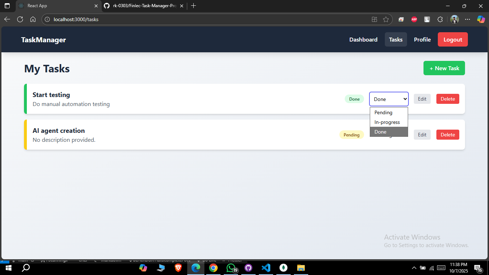

# TaskFin - Full-Stack Task Management Application

A complete full-stack task management application built with the MERN stack (MongoDB, Express, React, Node.js). This project allows users to securely register, log in, and perform full CRUD (Create, Read, Update, Delete) operations on their tasks.

---

## Features

-   **User Authentication:** Secure user registration and login with JSON Web Token (JWT) based authentication.
-   **Task Management (CRUD):**
    -   **Create:** Users can add new tasks with a title and description.
    -   **Read:** View all tasks in a clean, organized list.
    -   **Update:** Edit existing tasks and change their status (`Pending`, `In-progress`, `Done`).
    -   **Delete:** Remove tasks that are no longer needed.
-   **User Profiles:** A dedicated page to view user profile information (name and email).
-   **Protected Routes:** Backend API routes are protected, ensuring users can only access their own data.
-   **Modern UI/UX:** A clean, responsive interface with a modern color scheme, interactive forms, and clear navigation.
-   **Visual Status Indicators:** Tasks are color-coded with a left border and status badge to easily identify their current state.

---

## Tech Stack

-   **Frontend:**
    -   React.js
    -   React Router
    -   Tailwind CSS (via CDN)
    -   Axios
-   **Backend:**
    -   Node.js
    -   Express.js
-   **Database:**
    -   MongoDB with Mongoose
-   **Authentication:**
    -   bcrypt.js (for password hashing)
    -   JSON Web Token (JWT)

---

## Application Screenshots


*Login Page with modern UI*


*Dashboard showing color-coded tasks*

---

## Setup and Installation

To run this project locally, follow these steps:

**Prerequisites:**
-   Node.js
-   npm (Node Package Manager)
-   MongoDB

1.  **Clone the repository:**
    ```bash
    git clone <your-repository-url>
    cd Finlec-Task-Manager-Project
    ```

2.  **Setup the Backend Server:**
    ```bash
    cd server
    npm install
    ```
    Create a `.env` file in the `server` directory and add the following variables:
    ```
    MONGO_URI=mongodb://127.0.0.1:27017/taskmanager
    JWT_SECRET=your_super_secret_key
    ```
    Start the server:
    ```bash
    npm start
    ```

3.  **Setup the Frontend Client:**
    (Open a new terminal for this step)
    ```bash
    cd client
    npm install
    ```
    Start the client:
    ```bash
    npm start
    ```
    The application will be running at `http://localhost:3000`.

---

## Product Thinking & Future Features

-   **Task Prioritization:** Add a priority level (Low, Medium, High) to tasks.
-   **Due Dates & Reminders:** Implement deadlines and notifications.
-   **User Collaboration:** Allow users to share tasks or create team-based projects.